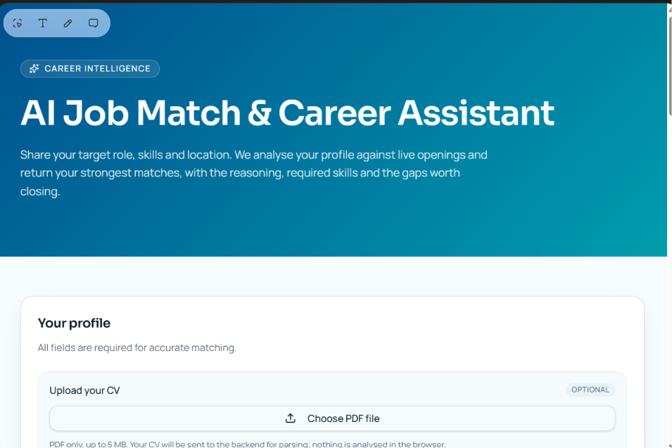
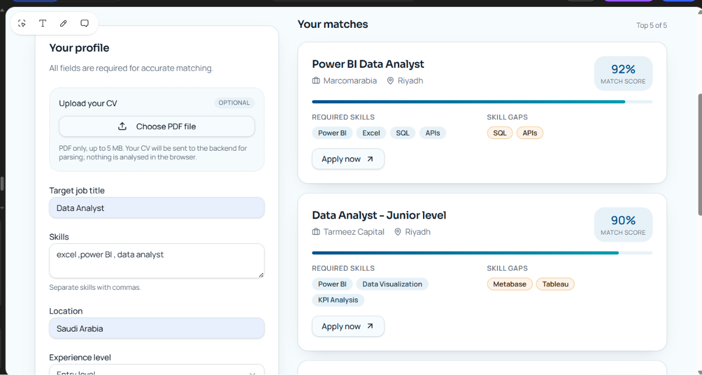
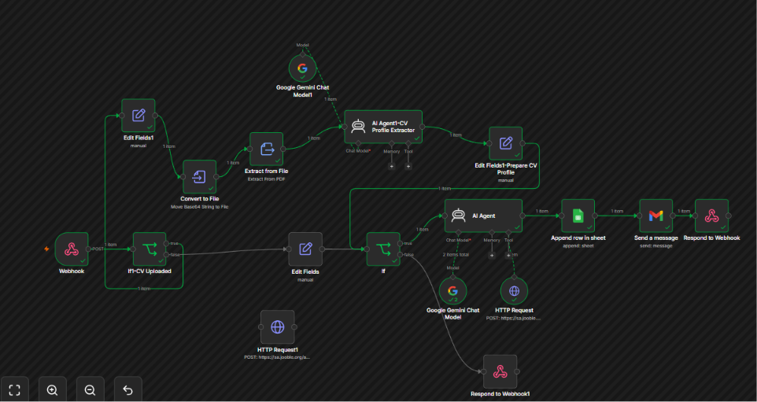

# AI Job Match & Career Assistant

An n8n automation that helps job seekers find and evaluate relevant opportunities based on their target role, skills, location, experience, and CV profile.

## Overview

The workflow accepts job-search preferences through a webhook, validates the input, optionally extracts a candidate profile from an uploaded CV, searches real job listings, uses Google Gemini to reason about fit, stores results in Google Sheets, and can send results by Gmail.

The project was designed around entry-level Data Analyst searches in Saudi Arabia, including Riyadh, Jeddah, Dammam, and remote/hybrid opportunities.

## Project preview

### User interface



### Ranked job matches



### n8n workflow execution



## What the workflow does

1. Receives search criteria through an n8n webhook.
2. Validates required fields and handles incomplete requests.
3. Extracts text and structured profile information when a CV is provided.
4. Builds targeted job-search criteria from the candidate profile and preferences.
5. Searches Jooble for real opportunities.
6. Uses Gemini as the AI reasoning layer for job matching.
7. Saves matching results to Google Sheets.
8. Sends results by Gmail.
9. Returns a structured webhook response.

## Tech stack

- n8n
- Google Gemini
- Jooble API
- Google Sheets
- Gmail
- Webhooks / REST APIs

## Repository structure

```text
AI-Job-Match-Career-Assistant/
├── README.md
├── .gitignore
└── workflow/
    └── AI-Job-Match-Career-Assistant.json
```

## Setup

1. Import `workflow/AI-Job-Match-Career-Assistant.json` into n8n.
2. Add your own Google Gemini credential to the Gemini nodes.
3. Add your own Google Sheets credential and select the spreadsheet where you want to store results.
4. Add your own Gmail credential and configure the recipient address.
5. Replace `YOUR_JOOBLE_API_KEY` in the Jooble HTTP Request nodes with your own API key.
6. Review the webhook path and activate the workflow when you are ready to use the production webhook.

## Security

This public version intentionally excludes API keys, private keys, OAuth credentials, personal email addresses, spreadsheet identifiers, and n8n credential references. Never commit service-account JSON files or other secrets to a public repository.

## Future improvements

- Track application status from Applied to Interview, Rejected, or Offer.
- Monitor email for application-status updates.
- Add configurable scoring and ranking for job fit.
- Expand supported job sources and locations.
- Add a simple user-facing dashboard.

## Author

Raneem Alzahrani

- [LinkedIn](https://www.linkedin.com/in/raneem-alzhrani-/)
- [Portfolio](https://sites.google.com/view/raneemalzahrany/home)
- [GitHub](https://github.com/Raneem6)
